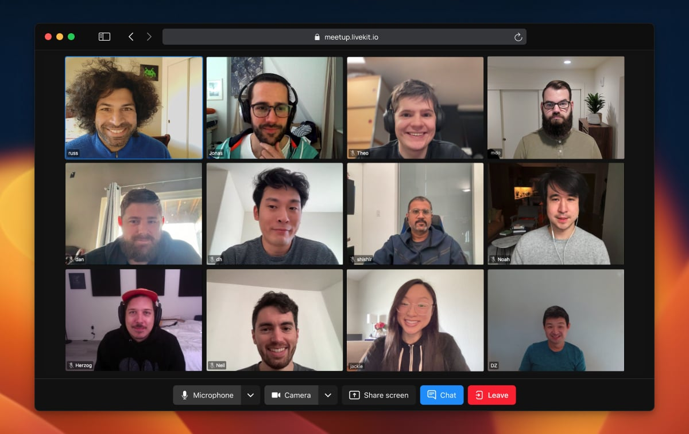

# FishMeet

FishMeet is a video conferencing app built with Next.js and real-time audio/video components.

  <a href="https://fishmeet.top"><strong>Try FishMeet</strong></a>

 

## Tech Stack

- This is a [Next.js](https://nextjs.org/) project bootstrapped with [`create-next-app`](https://github.com/vercel/next.js/tree/canary/packages/create-next-app).
- App is built with real-time audio/video React components.

## Demo

Give it a try at https://fishmeet.top.

## Dev Setup

Steps to get a local dev setup up and running:

1. Run `pnpm install` to install all dependencies.
2. Copy `.env.example` in the project root and rename it to `.env.local`.
3. Update the missing environment variables in the newly created `.env.local` file.
4. Run `pnpm dev` to start the development server and visit [http://localhost:3000](http://localhost:3000) to see the result.
5. Start development 🎉
